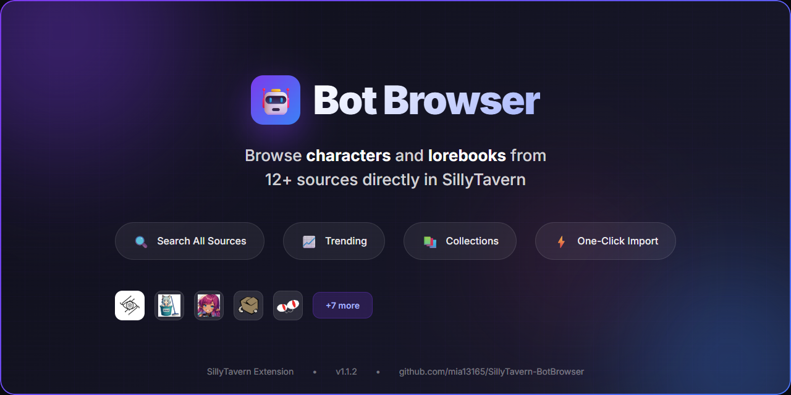
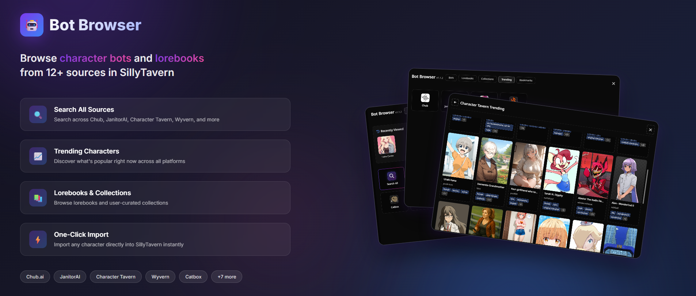

# Bot Browser

Browse character bots and lorebooks from various sources directly in SillyTavern.

## Installation

Install via the SillyTavern extension installer:

```
https://github.com/mia13165/SillyTavern-BotBrowser
```

## How to Use

Click the bot icon next to the import bots button.


Browse cards, click one to see details, hit import to SillyTavern if you want it.


## Tabs

- **Bots** - Browse character cards from various sources
- **Lorebooks** - Browse lorebooks from various sources
- **Collections** - Browse JannyAI user-created collections
- **Trending** - See what's popular on Chub, JanitorAI/JannyAI, Character Tavern, and Wyvern
- **Bookmarks** - Quick access to your saved cards

## Features

- **My Imports** - View all characters you've imported through Bot Browser, with quick access to start a chat
- **Recently Viewed** - Quick access to cards you've recently looked at
- **Random Card** - Discover new characters with the random button
- **Import Stats** - Track your import history and see your most used sources
- **Tag Blocklist** - Filter out content you don't want to see
- **Blur NSFW** - Option to blur NSFW card images



## Sources

- [Character Tavern](https://character-tavern.com)
- [Catbox](https://catbox.moe)
- [Webring](https://chatbots.neocities.org/)
- [Chub](https://chub.ai)
- [Anchorhold/aicg](https://partyintheanchorhold.neocities.org/)
- [Risuai Realm](https://realm.risuai.net)
- [Nyai.me](https://nyai.me)
- [Desuarchive](https://desuarchive.org)
- [MLPchag](https://mlpchag.neocities.org)
- [JanitorAI](https://janitorai.com) / [JannyAI](https://jannyai.com)
- [Wyvern Chat](https://wyvern.chat)
- [QuillGen](https://quillgen.app) (via direct API)

Data updates periodically from the repo. Sources could be unreliable/may stop working. Tested briefly on Moonlit Echoes theme, and on mobile. If you find any issues, please report them.