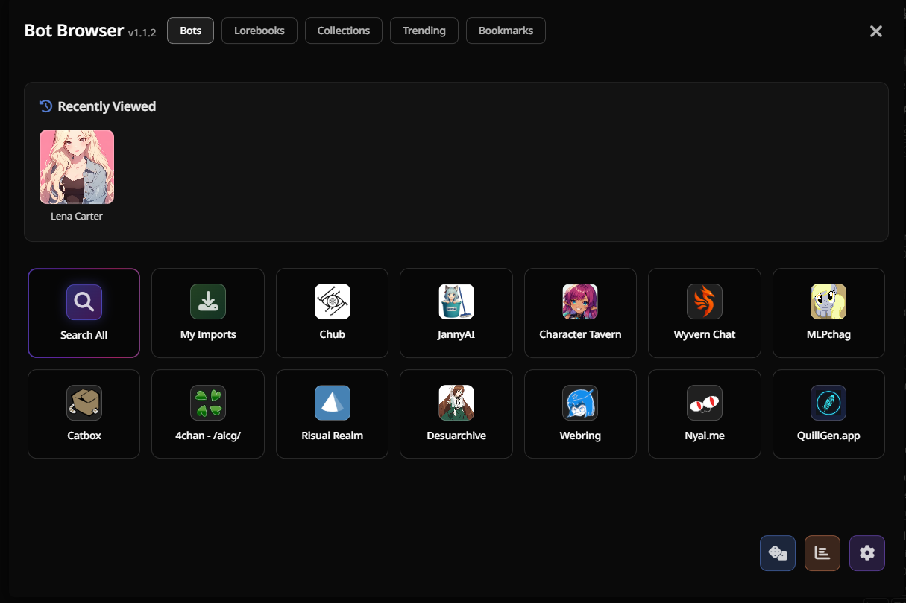
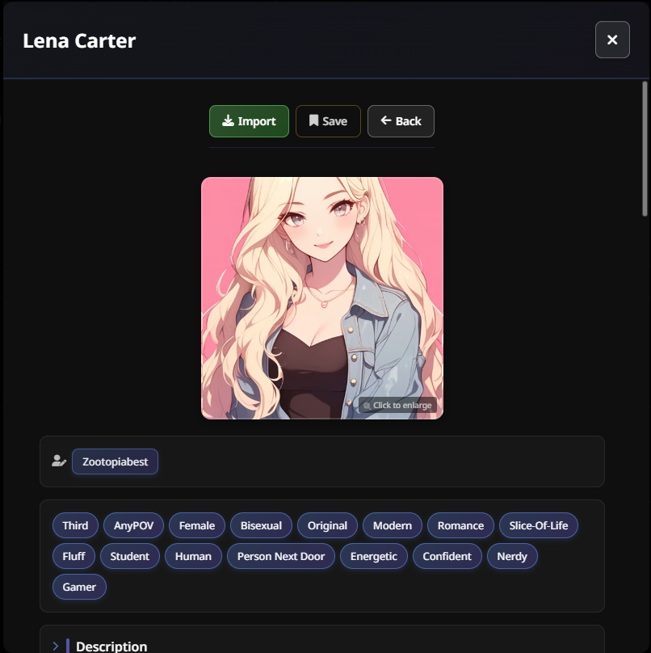

# Bot Browser

Browse character bots and lorebooks from various sources directly in SillyTavern.


## Installation

Install via the SillyTavern extension installer:

```
https://github.com/mia13165/SillyTavern-BotBrowser
```

## How to Use

Click the bot icon next to your character list.



Browse cards, click one to see details, hit import to SillyTavern if you want it.



## Sources

- Character Tavern
- Catbox
- Webring
- Chub
- Anchorhold/aicg
- Risuai Realm
- Nyai.me
- Desuarchive
- MLPchag
- [QuillGen](https://quillgen.app) (via direct API)

Data updates periodically from the repo. Tested briefly on Moonlit Echoes theme, and on mobile. If you find any issues, please report them.